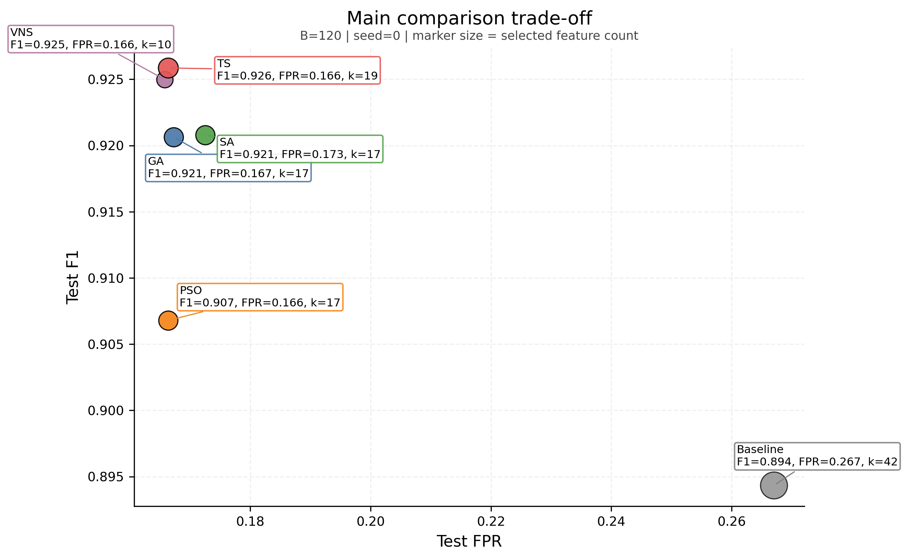
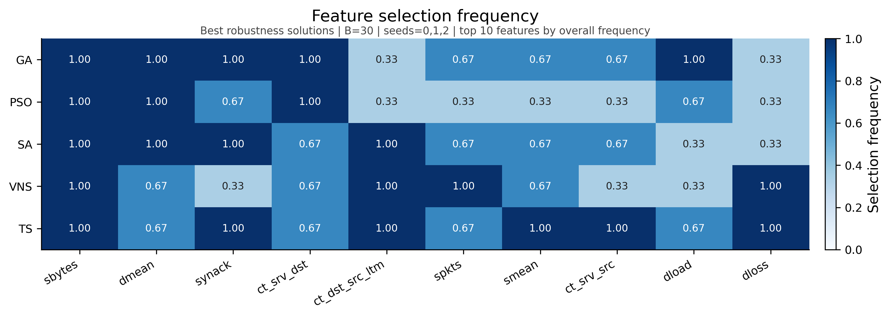
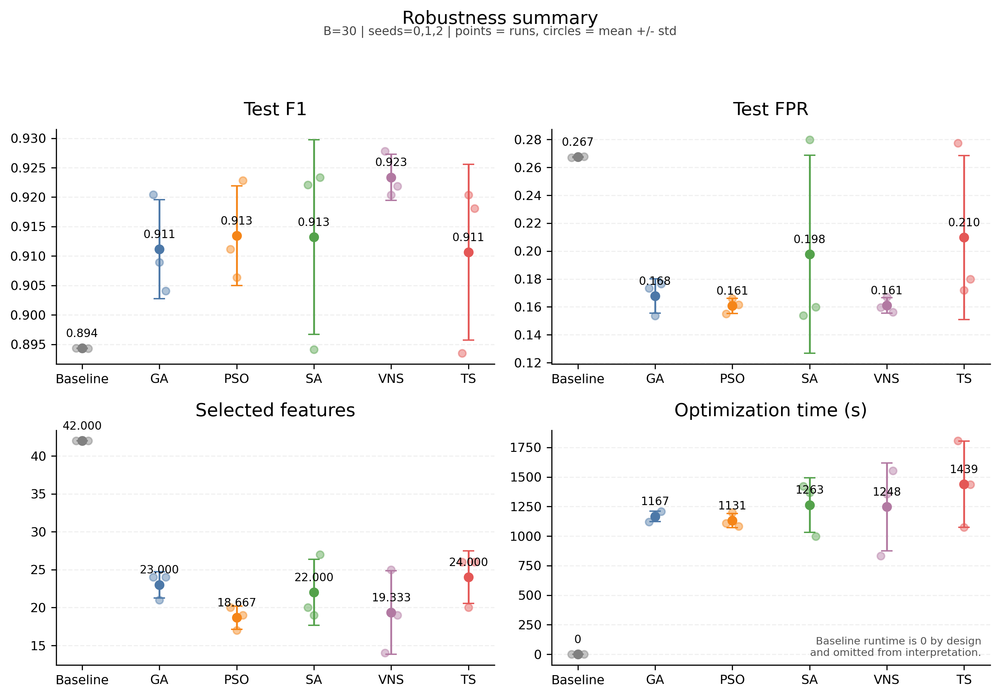

# Metaheuristic Feature Selection and Hyperparameter Optimization for Random Forest-Based Intrusion Detection on UNSW-NB15

## Abstract

This paper studies wrapper-based feature selection and hyperparameter optimization for binary intrusion detection on the `UNSW-NB15` dataset using a Random Forest (RF) classifier. The goal is not only to improve predictive quality, but also to reduce false positives, feature count, and unnecessary computational cost. A default RF with all grouped original features is used as the non-metaheuristic baseline. The main comparative analysis focuses on three literature-supported optimizers, namely Genetic Algorithm (GA), Particle Swarm Optimization (PSO), and Simulated Annealing (SA), while Tabu Search and Variable Neighborhood Search (VNS) are still reported in the overall empirical comparison. Results are interpreted using `F1`, `Recall`, `FPR`, selected feature count, and runtime rather than a single headline metric. Under the main `B = 120`, `seed = 0` comparison, Tabu Search achieves the highest raw `F1`, whereas VNS provides the strongest overall balance by combining near-best `F1` with the lowest `FPR` among the strongest methods and the smallest feature subset. Lightweight robustness evidence at `B = 30`, seeds `0, 1, 2` strengthens the interpretation that, among the implemented methods, VNS provides the most convincing balanced trade-off under the reported budget and seed setting. A limited optimizer-specific tuning follow-up shows no material improvement for PSO or SA, while a tuned Tabu neighborhood setting produces only a modest repeated-run gain that does not change the broader ranking. The study therefore emphasizes that IDS performance should be judged through security-aware trade-offs rather than by raw `F1` alone.

## Keywords

Intrusion detection system; UNSW-NB15; feature selection; hyperparameter optimization; Random Forest; genetic algorithm; particle swarm optimization; simulated annealing; tabu search; variable neighborhood search

## 1. Introduction

### 1.1 Background and Motivation

Network intrusion detection systems (IDS) are expected to identify malicious activity while maintaining an operationally acceptable false-alarm burden. This is difficult in contemporary network environments because traffic patterns are heterogeneous, attacks are diverse, and benchmark datasets contain many features with uneven predictive value. In practice, an IDS that achieves high recall at the cost of excessive false positives may still be operationally weak, because it overloads analysts with benign alerts and reduces trust in the system. For this reason, intrusion detection should be treated as a security trade-off problem rather than as an accuracy-only classification task.

The `UNSW-NB15` dataset remains a useful benchmark for this setting because it was designed to reflect modern network traffic and multiple attack families more faithfully than older datasets. It contains a mixture of categorical protocol/state attributes and derived traffic statistics, which makes it suitable for studying both model selection and feature-selection behaviour. Prior work on `UNSW-NB15` has shown that conventional classifiers such as Random Forest (RF) can already provide strong detection performance, but also that redundant or weakly informative features can increase noise, computational overhead, and overfitting risk [Kasongo and Sun, 2020; Dawood et al., 2024]. Recent studies further show that `UNSW-NB15` feature-selection pipelines often use RF-derived importance information, which reinforces the role of RF as a natural benchmark in this problem setting [Yin et al., 2023].

These characteristics motivate two linked optimisation tasks. The first is feature selection, where the goal is to remove unnecessary features while preserving detection quality. The second is hyperparameter optimisation, where the aim is to find better-performing model configurations than fixed default settings. Solving these tasks jointly is attractive because the usefulness of a feature subset depends on the classifier configuration used to exploit it. However, the joint search space of feature subsets and model hyperparameters is combinatorial and too large for exhaustive search. Metaheuristic optimisation therefore provides a practical way to explore this space under a fixed evaluation budget.

### 1.2 Research Objective

This study evaluates whether metaheuristic search can produce meaningful improvements over a non-metaheuristic RF baseline on `UNSW-NB15`. The comparison is not limited to predictive quality alone. Instead, the analysis explicitly considers `F1`, `Recall`, `FPR`, selected feature count, and runtime, because an IDS method should be judged by its overall security and operational trade-off rather than by a single metric. The project uses wrapper-based search, where candidate feature subsets and RF hyperparameters are evaluated directly through model performance on a validation split.

This study reports overall empirical results for all implemented methods, namely RF, GA, PSO, SA, Tabu Search, and VNS. The focused comparative discussion centers on RF, GA, PSO, and SA because these methods are supported most directly by recent IDS optimization literature.

### 1.3 Contributions

This study makes four contributions. First, it provides a reproducible comparison of metaheuristic wrapper methods for `UNSW-NB15` under a common preprocessing pipeline, a shared RF search space, and explicit fairness rules. Second, it reports an overall empirical comparison across all implemented methods, rather than selectively presenting only a subset of them. Third, it keeps the main interpretive focus aligned with the strongest IDS-specific literature support while still reporting the broader empirical picture transparently. Fourth, it analyses security trade-offs directly by discussing not only detection quality but also false positives, feature reduction, runtime, and recurring feature relevance patterns.

## 2. Related Work and Study Positioning

### 2.1 IDS on UNSW-NB15 and Conventional Baselines

`UNSW-NB15` has been used extensively to evaluate machine learning-based IDS models, especially in studies that compare conventional classifiers before or alongside feature-selection or optimisation techniques. In this literature, RF is a particularly defensible baseline. Kasongo and Sun compared conventional classifiers on `UNSW-NB15` and highlighted RF as one of the strongest overall conventional methods in that setting [Kasongo and Sun, 2020]. Dawood et al. similarly reported that RF performs strongly relative to other standard learners on `UNSW-NB15`, including in terms of false-alarm behaviour [Dawood et al., 2024]. Even when RF is not the final classifier under study, it remains common as a feature-importance mechanism inside `UNSW-NB15` feature-selection pipelines [Yin et al., 2023].

This pattern matters for the present work. The baseline in this paper is not intended to be weak or trivial. It is intended to be a credible non-metaheuristic benchmark that reflects a practical, widely recognisable IDS starting point. Using a default RF with all available grouped features therefore provides a strong reference level against which the value of optimisation can be measured.

### 2.2 Metaheuristic Optimisation for IDS

Recent IDS optimisation literature provides the strongest direct support for `GA` and `PSO`, with `SA` remaining supportable but somewhat less central. `GA` is well established in IDS feature-selection research and also appears in recent work on IDS hyperparameter tuning and hybrid optimisation pipelines [Halim et al., 2021; Bakır and Ceviz, 2024]. This makes it a natural evolutionary benchmark for the present study. `PSO` is similarly well supported in IDS-specific optimisation work, especially in wrapper-based feature selection and hyperparameter optimisation contexts [Chohra et al., 2022; Kilichev and Kim, 2023]. Together, `GA` and `PSO` can be described safely as widely used benchmark metaheuristics for IDS optimisation.

`SA` is somewhat different. It has weaker direct support in recent IDS literature than `GA` or `PSO`, but it still has relevant IDS-adjacent evidence. Huang et al. incorporated simulated annealing behaviour into an IDS-oriented hybrid feature-selection framework and showed that annealing-style acceptance mechanisms remain relevant to recent intrusion-detection optimisation [Huang et al., 2024]. More broadly, `SA` remains a recognised feature-selection metaheuristic in general optimisation literature, even if its IDS-specific presence is not as strong as that of `GA` and `PSO`. In this paper, `SA` is therefore retained as the stochastic local-search member of the primary comparison set rather than being presented as the dominant IDS optimiser.

### 2.3 Additional Local-Search Comparators

`Tabu Search` and `VNS` are also relevant to the optimisation problem considered here, but their literature position is weaker in direct IDS terms. `Tabu Search` has established historical use in feature selection and remains active in recent feature-selection research outside IDS [Huerta et al., 2002; Pacheco et al., 2023]. `VNS` is likewise a valid high-dimensional feature-selection strategy and has a strong general optimisation pedigree, but its recent direct support in IDS-specific literature appears weaker than that of `GA` or `PSO` [Consoli et al., 2016; Mladenović et al., 2017]. For that reason, neither method is used as a core literature-backed benchmark in the main comparative discussion.

This positioning does not imply that `Tabu Search` or `VNS` are invalid or unimportant. Instead, they are retained because they can still illuminate the behaviour of the broader search landscape. If either method performs strongly in the empirical study, that outcome is reported directly and interpreted with the same metric framework used for the core comparison.

### 2.4 Positioning of This Study

The study is positioned as a comparison between a strong conventional baseline and three core metaheuristics, while still reporting the outcomes of two additional local-search methods. Accordingly, the main comparative focus is `RF`, `GA`, `PSO`, and `SA`, with `Tabu Search` and `VNS` retained to broaden the empirical picture without making stronger literature claims than the evidence can support.

## 3. Problem Formulation and Experimental Protocol

### 3.1 Task Definition

The task is binary intrusion-detection classification on `UNSW-NB15`. Given the provided training and test files, the goal is to learn a model that can distinguish normal from malicious traffic while maintaining a useful security trade-off. In this project, that trade-off is defined by a combination of strong detection quality, controlled false-positive behaviour, compact feature subsets, and reasonable runtime. The optimisation problem therefore goes beyond standard classification and instead seeks a balanced IDS configuration.

More formally, the search procedure jointly optimises a grouped original-feature subset and a Random Forest hyperparameter setting. Candidate solutions are evaluated through validation performance rather than test-set feedback, so the test set remains reserved for final one-shot evaluation after optimisation. This preserves test-set integrity and aligns the search process with a standard wrapper-optimisation protocol.

### 3.2 Data and Preprocessing

The project uses `dataset/UNSW_NB15_training-set.csv` and `dataset/UNSW_NB15_testing-set.csv`, with `label` as the binary target and `id` plus `attack_cat` removed from the feature space. The outer train/test split is therefore determined by the provided dataset files. Within the training portion, an additional validation split of `0.2` is used for optimisation. This inner split is stratified and seeded, and the same split is reused across the baseline and all compared metaheuristics for a given seed.

Preprocessing is leakage-safe. Numeric features are imputed using the median, while categorical features are imputed using the most frequent category. The categorical variables `proto`, `service`, and `state` are one-hot encoded with `handle_unknown="ignore"`. Importantly, the preprocessing pipeline is fit on the training partition only and then applied to the validation and test partitions via transformation. This design avoids leaking validation or test information into the fitted preprocessing state.

The feature-selection stage operates over grouped original features rather than over raw one-hot columns independently. This is important because it preserves the semantic meaning of the original variables and avoids degenerate solutions in which partial one-hot fragments of the same original feature are selected inconsistently.

Figure 1 should summarise the full experimental pipeline so that the reader can see, in one place, how leakage prevention, baseline comparison, and wrapper-based optimisation fit together.

> 図挿入指示: ここに、この画像を添付してください。想定ファイル名は `Course_Work/docs/generated/figures/pipeline_overview_unsw_rf_metaheuristic.png` です。
>
> この図に必ず入れる要素:
> - `UNSW-NB15 training set` と `UNSW-NB15 testing set`
> - training set から `train / validation split`
> - `preprocessing fit on train only`
> - validation/test への `transform only`
> - `Baseline branch: all grouped features + default RF`
> - `Metaheuristic branch: grouped feature subset + RF hyperparameters`
> - `validation-based optimisation`
> - `final one-shot test evaluation`
> - `same split / same preprocessing / same evaluator / same budget accounting`

*Figure 1. End-to-end experimental pipeline used in this study, showing the leakage-safe preprocessing flow, the baseline RF branch, the metaheuristic optimisation branch, and the final one-shot test evaluation.*

### 3.3 Baseline Model

The baseline model is a default RF using all original grouped features and no metaheuristic search. The baseline hyperparameters are `n_estimators = 100`, `max_depth = None`, `min_samples_split = 2`, `min_samples_leaf = 1`, `max_features = "sqrt"`, and `class_weight = None`. This baseline serves two purposes. First, it provides a strong conventional reference point from the IDS literature. Second, it makes it possible to assess whether the additional computational cost of metaheuristic search is justified by improvements in detection quality, false-positive control, feature reduction, or runtime trade-off.

### 3.4 Search Representation

Each candidate solution combines two components: a grouped original-feature selection mask and six RF hyperparameter genes. The decoding logic is implemented in `src/representation.py`. At least `k_min = 8` original features must remain selected, which prevents degenerate near-empty subsets and ensures that the resulting classifiers remain meaningful. For the main local `B=120` experiments, the RF search space is restricted to practical ranges: `n_estimators` in `[100, 300]`, `max_depth` in `[6, 20]`, `min_samples_split` in `[2, 20]`, `min_samples_leaf` in `[1, 8]`, `max_features` in `{"sqrt", "log2"}`, and `class_weight` in `{None, "balanced"}`.

### 3.5 Fitness Function

The implemented fitness function rewards recall while penalising both excessive false positives and unnecessarily large feature subsets. In `src/evaluator.py`, fitness is defined as:

`fitness = recall - lambda_fpr * max(0, fpr - alpha_fpr) - lambda_feat * (k / d)`

where `alpha_fpr = 0.05`, `lambda_fpr = 20.0`, `lambda_feat = 0.2`, `k` is the number of selected original features, and `d` is the total number of original features. This design reflects the fact that IDS performance should not be judged by recall alone. A method that achieves high recall by producing too many false alarms is not necessarily operationally preferable. Likewise, a feature subset should not be rewarded merely for being small if that reduction is achieved through a serious loss in detection quality.

The results narrative therefore relies on directly interpretable metrics such as `F1`, `Recall`, `FPR`, selected feature count, and runtime rather than on an ambiguous composite headline score. This is especially important because one legacy logged `GA` main-run composite score is not fully aligned with the final evaluator definition.

### 3.6 Evaluation Criteria

The evaluation uses `Accuracy`, `Precision`, `Recall`, `F1`, `FPR`, selected feature count, and runtime. These metrics align both with common `UNSW-NB15` reporting practice and with the coursework requirement to discuss trade-offs between predictive performance, false positives, and feature count. Among these metrics, `F1`, `Recall`, and `FPR` are the most important for interpretation, because they jointly capture the balance between successful detection and operational alert noise. Selected feature count is included because the project is explicitly a feature-selection study, and runtime is included because an optimiser that is only marginally better but substantially more expensive may offer limited practical value.

### 3.7 Reproducibility and Fairness Policy

All compared methods use the same dataset split for a given seed, the same preprocessing pipeline, the same evaluator logic, the same feature-selection representation, and the same evaluation-budget accounting policy. Within each comparison family, the RF search-space policy is also kept fixed. The main comparison uses the strongest available local setting, `B = 120` and `seed = 0`, while lightweight robustness evidence is drawn separately from `B = 30` runs over seeds `0, 1, 2`. These robustness runs are used only to qualify stability and should not be interpreted as equivalent in strength to the main `B = 120` comparison.

## 4. Algorithms

### 4.1 Primary Algorithms

#### Genetic Algorithm

`GA` represents the evolutionary-search family in the primary comparison. It evolves a population of candidate solutions using selection, crossover, and mutation, which makes it suitable for mixed search spaces that contain both discrete feature decisions and structured hyperparameter choices. In the present work, `GA` is included because it is one of the strongest IDS-backed optimisation benchmarks and because its search behaviour offers a useful balance between broad exploration and exploitation of promising regions. It is expected to perform well when interactions between feature subsets and RF hyperparameters need to be discovered jointly.

#### Particle Swarm Optimization

`PSO` represents the swarm-intelligence family. It maintains a population of particles that move in the search space using both their own historical best position and the global best position discovered so far. In a mixed wrapper-optimisation setting, this makes `PSO` a strong contrast to `GA`: both are population-based, but they update solutions according to different search dynamics. `PSO` is included because recent IDS literature directly supports it as a widely used optimisation benchmark, especially for feature selection and hyperparameter tuning. In this study, it is expected to offer efficient broad search under a fixed evaluation budget.

#### Simulated Annealing

`SA` represents stochastic local search in the primary comparison. Unlike `GA` and `PSO`, it operates on a single current solution and accepts some worse moves probabilistically, with the acceptance tendency decreasing over time. This makes `SA` relevant when the search space is rugged and contains many local optima. It is included as the primary local-search comparator because it has more direct IDS-relevant support than other local-search candidates and because its probabilistic acceptance rule offers a conceptually different search behaviour from population-based methods. In the present work, `SA` serves as the primary benchmark for local improvement under controlled stochastic exploration.

### 4.2 Additional Algorithms

#### Tabu Search

`Tabu Search` is included as an additional memory-based local-search comparator. Its defining idea is to use a tabu list to prevent immediate revisiting of recently explored solutions, thereby encouraging diversification while still exploiting local structure. This is relevant to the current optimisation problem because grouped feature masks and RF hyperparameters create a mixed discrete search space in which local revisitation can be wasteful. `Tabu Search` is not treated as a primary method because its recent direct IDS literature support is weaker than that of `GA`, `PSO`, and `SA`. However, it remains methodologically meaningful and is retained to help interpret how memory-guided local search behaves relative to the main methods.

#### Variable Neighborhood Search

`VNS` is included as an additional neighborhood-changing local-search comparator. Its core principle is that a solution that is locally optimal under one neighborhood structure may not be locally optimal under another. By changing neighborhood structures systematically, `VNS` can escape local optima without relying on a population. This is attractive for high-dimensional feature-selection problems and is supported by general feature-selection literature. Nevertheless, `VNS` is treated as an additional method rather than a primary benchmark because recent direct IDS-specific support is weaker than for `GA` and `PSO`. `VNS` is therefore included as an additional empirical comparator that may still produce strong results, but without being overclaimed as a core IDS benchmark.

### 4.3 Algorithm Comparison Summary

Table 1 summarizes the practical differences among the compared optimizers. This is useful because the methods differ not only in literature support but also in how they traverse the same mixed search space under the same evaluation budget.

| Method | Search unit | Main exploration mechanism | Main exploitation mechanism | Memory / acceptance device | Stopping rule |
| --- | --- | --- | --- | --- | --- |
| `GA` | population of candidate solutions | crossover and mutation over mixed feature-hyperparameter encodings | selection pressure toward higher-fitness individuals | population diversity | evaluation budget `B` exhausted |
| `PSO` | swarm of particles | velocity-driven movement toward personal and global best regions | attraction to historically good positions | personal-best and global-best memory | evaluation budget `B` exhausted |
| `SA` | single incumbent solution | probabilistic acceptance of some worse moves early in search | gradual cooling toward local refinement | temperature-controlled acceptance rule | evaluation budget `B` exhausted |
| `Tabu Search` | single incumbent solution with neighborhood scan | forced neighborhood exploration with short-term move prohibition | best admissible local move selection | tabu list | evaluation budget `B` exhausted |
| `VNS` | single incumbent solution across multiple neighborhoods | systematic neighborhood changes to escape local optima | local improvement inside each neighborhood | neighborhood-switching schedule | evaluation budget `B` exhausted |

*Table 1. Practical comparison of the search behaviour used by the five optimizers.*

## 5. Results

### 5.1 Overall Results for All Methods

Table 2 reports the overall results for all implemented methods under the strongest available main-run setting, `B = 120` and `seed = 0`. This full table is important because it prevents the analysis from selectively reporting only the methods that align most neatly with the literature review. The baseline `RF` result remains a strong conventional reference point, especially in recall, but it also exhibits a much higher false positive rate and uses all available grouped features. All optimised methods improve substantially over the baseline in `F1`, `FPR`, and feature count, indicating that metaheuristic search adds value beyond a default classifier configuration.

| Method | Accuracy | Precision | Recall | F1 | FPR | Features | Optimization Time (s) | Total Time (s) |
| --- | ---: | ---: | ---: | ---: | ---: | ---: | ---: | ---: |
| RF | 0.8718 | 0.8188 | 0.9852 | 0.8943 | 0.2670 | 42 | 0.00 | 55.55 |
| GA | 0.9080 | 0.8766 | 0.9694 | 0.9206 | 0.1672 | 17 | 5417.40 | 5489.78 |
| PSO | 0.8934 | 0.8740 | 0.9421 | 0.9068 | 0.1664 | 17 | 3770.89 | 3797.22 |
| SA | 0.9078 | 0.8736 | 0.9733 | 0.9208 | 0.1725 | 17 | 5695.27 | 5751.24 |
| Tabu Search | 0.9137 | 0.8782 | 0.9790 | 0.9259 | 0.1664 | 19 | 3919.99 | 3961.71 |
| VNS | 0.9128 | 0.8783 | 0.9769 | 0.9250 | 0.1658 | 10 | 4814.76 | 4868.60 |

*Table 2. Main-run comparison for all implemented methods at `B = 120`, `seed = 0`.*

Within the overall comparison, the top-performing methods are `Tabu Search` and `VNS`. `Tabu Search` achieves the highest raw `F1` in the main comparison (`0.9259`), while `VNS` achieves nearly the same `F1` (`0.9250`) but with the lowest `FPR` among the top methods (`0.1658`) and the most compact feature subset (`10` selected original features). This result motivates a distinction between the method with the highest raw `F1` and the method with the best overall balance across security and efficiency criteria. Under that broader judgment, `VNS` provides the most convincing overall trade-off among the implemented methods within the reported budget and seed setting.

This distinction matters because the project is not attempting to maximise a single headline metric in isolation. In IDS, a method that marginally improves `F1` but does so with a larger feature subset or a slightly worse false positive profile may not be the most operationally attractive option. The main-comparison evidence therefore supports the following careful interpretation: `Tabu Search` is the strongest method by raw `F1` in the main run, whereas `VNS` is the strongest method by balanced judgment.

### 5.2 Primary Comparison Focus

The focused comparison in Table 3 isolates `RF`, `GA`, `PSO`, and `SA`. Within this group, all three metaheuristics outperform the `RF` baseline in `F1`, `FPR`, and feature count reduction. This confirms that the value of metaheuristic optimisation is not merely cosmetic: the search procedures materially improve the detection trade-off while producing much smaller feature subsets.

| Method | Accuracy | Precision | Recall | F1 | FPR | Features | Optimization Time (s) | Total Time (s) |
| --- | ---: | ---: | ---: | ---: | ---: | ---: | ---: | ---: |
| RF | 0.8718 | 0.8188 | 0.9852 | 0.8943 | 0.2670 | 42 | 0.00 | 55.55 |
| GA | 0.9080 | 0.8766 | 0.9694 | 0.9206 | 0.1672 | 17 | 5417.40 | 5489.78 |
| PSO | 0.8934 | 0.8740 | 0.9421 | 0.9068 | 0.1664 | 17 | 3770.89 | 3797.22 |
| SA | 0.9078 | 0.8736 | 0.9733 | 0.9208 | 0.1725 | 17 | 5695.27 | 5751.24 |

*Table 3. Primary comparison set used for the main interpretive analysis.*

Among the primary methods, `SA` records the highest raw `F1` in the main comparison (`0.9208`), but `GA` provides the strongest balanced primary result because it combines near-best `F1` with the best `FPR` among the primary methods (`0.1672`) and the same compact `17`-feature subset as `PSO` and `SA`. `PSO` is the fastest primary optimiser in the main run, but this speed advantage does not compensate for its weaker `F1` relative to both `GA` and `SA`. Accordingly, the main-comparison interpretation for the primary set is that `GA` is the strongest primary method by balanced judgment, while `SA` is the strongest primary method by raw `F1` only.

This distinction matters because reporting only the highest raw `F1` would suppress the fact that the current project judges methods by security-aware trade-offs rather than by a single score. The primary comparison therefore reinforces the need to interpret `F1` jointly with `FPR`, selected feature count, and runtime.

### 5.3 Trade-off and Security Implications

The central trade-off in this study is between detection quality and operational alert burden. `RF` shows why this matters: it attains very high recall but at the cost of a much higher `FPR` and no feature reduction. In practice, an IDS that raises too many false alerts creates analyst fatigue and reduces trust in the system. Therefore, lower `FPR` is not a secondary aesthetic preference; it is part of the security usefulness of the method.

Against this background, the optimised methods show a more attractive balance. `GA`, `PSO`, and `SA` all reduce the feature count from `42` to roughly `17` while also producing much lower `FPR` values than the baseline. This means the optimised methods are not merely smaller or faster; they also produce less alert noise. `Tabu Search` and `VNS` show that local-search families can also be highly competitive in this mixed optimisation setting, especially when the search objective explicitly penalises excessive false positives and unnecessarily large feature subsets.

> 図挿入指示: ここに、この画像を添付してください。`Course_Work/docs/generated/figures/main_tradeoff_b120.png`

*Figure 2. Main-run trade-off at `B = 120`, `seed = 0`. The figure plots `F1` against `FPR` and encodes selected feature count in marker size.*

Feature count also matters in security terms. A smaller selected subset can simplify deployment, improve interpretability, and reduce computational overhead, but only if the reduction does not come at an unacceptable cost in detection quality. This is one reason `VNS` is notable in the overall results: it achieves a top-tier `F1` with only `10` selected features, making its trade-off especially strong. Runtime is also relevant, although it should remain secondary to security usefulness. A method that runs faster is not automatically preferable if it delivers a materially weaker detection trade-off.

Feature relevance is also visible in the cross-method selection patterns. The feature-selection frequency analysis from the robustness best solutions shows that several variables recur across multiple methods and seeds rather than appearing arbitrarily. In particular, `sbytes`, `dmean`, `ct_srv_dst`, and `synack` are repeatedly selected across the robustness best solutions, while features such as `ct_dst_src_ltm`, `spkts`, and `sjit` appear frequently in method-specific selections. This suggests that the optimisation layer is not merely shrinking the feature set at random; it is repeatedly preserving a smaller subset of traffic-volume, service-distribution, and timing-related variables that appear consistently informative under the current evaluation setting.

> 図挿入指示: ここに、この画像を添付してください。`Course_Work/docs/generated/figures/feature_frequency_robustness_b30.png`

*Figure 3. Selection frequency of the top recurring grouped features across the robustness best solutions at `B = 30`, seeds `0, 1, 2`.*

### 5.4 Tabu Search and VNS in the Broader Empirical Comparison

`Tabu Search` demonstrates that a memory-based local-search strategy can be highly competitive in the main comparison, even outperforming all core methods in raw `F1` under the `B = 120, seed = 0` setting. However, the lightweight robustness evidence qualifies this result. Under `B = 30` with seeds `0, 1, 2`, `Tabu Search` retains strong recall, but its average `FPR` and average feature count are clearly less attractive than those of `VNS`.

| Method | Runs | Test F1 (mean +/- std) | Test FPR (mean +/- std) | Features (mean +/- std) | Optimization Time (s) |
| --- | ---: | --- | --- | --- | --- |
| RF | 3 | 0.8943 +/- 0.0000 | 0.2675 +/- 0.0004 | 42.00 +/- 0.00 | 0.00 +/- 0.00 |
| GA | 3 | 0.9112 +/- 0.0084 | 0.1678 +/- 0.0124 | 23.00 +/- 1.73 | 1166.64 +/- 44.74 |
| PSO | 3 | 0.9134 +/- 0.0085 | 0.1608 +/- 0.0054 | 18.67 +/- 1.53 | 1130.81 +/- 60.46 |
| SA | 3 | 0.9132 +/- 0.0165 | 0.1978 +/- 0.0711 | 22.00 +/- 4.36 | 1263.21 +/- 231.15 |
| VNS | 3 | 0.9234 +/- 0.0039 | 0.1610 +/- 0.0056 | 19.33 +/- 5.51 | 1247.57 +/- 372.54 |
| Tabu Search | 3 | 0.9106 +/- 0.0149 | 0.2098 +/- 0.0588 | 24.00 +/- 3.46 | 1438.84 +/- 365.44 |

*Table 4. Lightweight robustness comparison at `B = 30`, seeds `0, 1, 2`. This table qualifies stability and does not replace the stronger-budget main comparison.*

`VNS` is the more important broader-comparison result. It already performs strongly in the main comparison, where it combines near-best `F1` with the best `FPR` and the smallest selected subset among the strongest methods. The lightweight robustness evidence strengthens this interpretation rather than weakening it. Under `B = 30, seeds = 0, 1, 2`, `VNS` achieves the best overall robustness profile among the optimised methods by combined `F1`, `FPR`, and feature-count judgment. This does not change the literature-backed core comparison, but it does support the claim that, among the implemented methods, `VNS` offers the most convincing overall trade-off under the reported evaluation setting.

These results are therefore reported directly rather than treated as side notes. `Tabu Search` is a strong broader-comparison method, especially in the main run. `VNS` is a strong overall contender whose empirical behaviour is more convincing than its IDS-specific literature footprint alone would suggest.

> 図挿入指示: ここに、この画像を添付してください。`Course_Work/docs/generated/figures/robustness_summary_b30.png`

*Figure 4. Lightweight robustness summary at `B = 30`, seeds `0, 1, 2`, showing repeated-run spread for `F1`, `FPR`, selected feature count, and optimization time.*

### 5.5 Limited Optimizer-Specific Sensitivity Check

Because `PSO`, `SA`, and `Tabu Search` were all evaluated initially under fixed practical optimiser settings, a limited follow-up sensitivity check was run at `B = 30`, `seed = 0` to test whether small method-specific control changes materially altered their behaviour. The screening kept the dataset, preprocessing, grouped-feature representation, RF search space, and fairness rules fixed, and varied only a very small number of optimiser-specific parameters. For `PSO`, the tested controls were inertia and the `c1/c2` balance. For `SA`, the tested controls were `T0` and `alpha`. For `Tabu Search`, the tested controls were `tabu_tenure` and `neighborhood_size`.

The screening result was negative for `PSO` and `SA`. The screened `PSO` variants all converged to the same best solution as the current default setting, producing the same `F1` (`0.9093`), `FPR` (`0.1603`), and selected feature count (`20`) at the light budget. `SA` was also largely insensitive within the screened range: faster and slower cooling reproduced the default solution, higher `T0` was slightly worse, and lower `T0` was materially worse. Therefore, the limited evidence does not support promoting a new `PSO` or `SA` setting.

For `Tabu Search`, however, the neighborhood scan size mattered. Changing tabu tenure from `5` to `3` or `7` did not materially change the result, but increasing `neighborhood_size` from `3` to `5` improved the light-budget single-seed outcome from `F1 = 0.8600`, `FPR = 0.3962`, and `27` features to `F1 = 0.8945`, `FPR = 0.2773`, and `24` features. The tuned variant was slower (`1890.87 s` total versus `1699.89 s`), but the detection-quality and false-positive gains were large enough that this trade-off is favourable at the screening stage.

| Method | Current default setting | Best screened tuned setting | Default F1 | Tuned F1 | Default FPR | Tuned FPR | Default Features | Tuned Features | Default Total Time (s) | Tuned Total Time (s) | Interpretation |
| --- | --- | --- | ---: | ---: | ---: | ---: | ---: | ---: | ---: | ---: | --- |
| `PSO` | `w=0.7, c1=1.5, c2=1.5` | `w=0.7, c1=1.2, c2=1.8` | 0.9093 | 0.9093 | 0.1603 | 0.1603 | 20 | 20 | 1110.00 | 1066.51 | Same solution; no material improvement |
| `SA` | `T0=1.0, alpha=0.995` | `T0=1.0, alpha=0.99` | 0.9221 | 0.9221 | 0.1537 | 0.1537 | 20 | 20 | 1514.41 | 1438.58 | Same solution; runtime gain alone is not strong enough to promote |
| `Tabu Search` | `tabu_tenure=5, neighborhood_size=3` | `tabu_tenure=5, neighborhood_size=5` | 0.8600 | 0.8945 | 0.3962 | 0.2773 | 27 | 24 | 1699.89 | 1890.87 | Clear light-budget improvement; candidate for follow-up robustness check |

*Table 5. Limited optimiser-specific light-tuning screen at `B = 30`, `seed = 0`. This table is a narrow sensitivity check and does not replace the main `B = 120` comparison.*

This tuning evidence should be interpreted cautiously. It is only a light-budget, single-seed screen, so it should not silently replace the paper’s main fixed-setting comparison. The safest interpretation is therefore that the limited tuning pass does not materially change the conclusions for the primary methods, but it does identify a stronger `Tabu Search` neighborhood setting that deserves a small follow-up robustness check before any broader promotion.

That follow-up robustness check was then run at the same lightweight setting, `B = 30`, seeds `0, 1, 2`, using the tuned `Tabu Search` configuration with `tabu_tenure = 5` and `neighborhood_size = 5`. The tuned repeated-run profile was slightly better than the original fixed-setting Tabu robustness result: mean `F1` increased from `0.9106` to `0.9109`, mean `FPR` decreased from `0.2098` to `0.2082`, and mean selected features decreased from `24.00` to `23.33`, although mean optimisation time increased from `1438.84 s` to `1608.18 s`. This confirms that the tuned setting is directionally better, but the gain is small and does not materially alter the broader robustness interpretation.

| Tabu robustness setting | Mean F1 | Mean FPR | Mean selected features | Mean optimization time (s) | Interpretation |
| --- | ---: | ---: | ---: | ---: | --- |
| Original fixed setting (`tabu_tenure=5`, `neighborhood_size=3`) | 0.9106 | 0.2098 | 24.00 | 1438.84 | reference robustness profile |
| Tuned setting (`tabu_tenure=5`, `neighborhood_size=5`) | 0.9109 | 0.2082 | 23.33 | 1608.18 | slight balanced improvement, but not a clear ranking change |

*Table 6. Repeated-run comparison between the original and tuned Tabu robustness settings at `B = 30`, seeds `0, 1, 2`.*

## 6. Discussion and Threats to Validity

### 6.1 Interpretation of Primary Results

The primary results are partly consistent with the literature review. `GA` and `PSO` behave as expected from recent IDS optimisation studies in the sense that both are competitive, both substantially outperform the baseline on the most important trade-off metrics, and both operate effectively in the mixed feature-selection and hyperparameter space. `SA` also proves to be a meaningful member of the primary set. Although its direct IDS literature support is weaker than that of `GA` and `PSO`, its empirical behaviour in the main comparison justifies its inclusion as a stochastic local-search benchmark.

At the same time, the primary results show that literature support and empirical ranking are not identical. `GA` is the strongest primary method by balanced judgment in the main `B = 120, seed = 0` comparison, largely because it offers the best `FPR` among the primary methods while maintaining near-top `F1`. However, the lighter-budget robustness evidence suggests a more nuanced picture: under `B = 30, seeds = 0, 1, 2`, `PSO` becomes the strongest primary method by balanced judgment. This does not overturn the main result, because the project treats the stronger-budget `B = 120` runs as the main comparison and the lighter-budget runs as stability qualifiers. The limited optimiser-specific tuning screen also reinforces caution here: it did not reveal a materially better `PSO` or `SA` configuration under the light-budget setting, so the primary-method interpretation remains unchanged.

### 6.2 Interpreting Additional Methods

The most interesting mismatch in the study lies in the broader empirical comparison. From a literature-support standpoint, `Tabu Search` and `VNS` are weaker than `GA` and `PSO`, especially in direct recent IDS support. From an empirical standpoint, however, they are highly competitive. The strongest example is `VNS`, which provides the most convincing overall trade-off by balanced judgment in the reported comparison setting. This outcome shows that restricting the analysis only to the core set would have hidden one of the most meaningful results in the project.

`Tabu Search` is also instructive. Its strong single-run result indicates that memory-based local search can be effective in the present search space, but the robustness evidence suggests that this strength is less stable than that of `VNS`. The limited tuning screen refines this point slightly: a larger neighborhood scan improved the light-budget single-seed `Tabu Search` result substantially, and the follow-up repeated-run check retained a small improvement over the original fixed-setting Tabu robustness profile. This suggests that part of the weaker `B = 30` fixed-setting profile is configuration-sensitive rather than purely method-intrinsic. Even so, the repeated-run gain remains modest and does not overturn the broader interpretation. `Tabu Search` should therefore still be described as a strong broader-comparison method whose robustness profile improves slightly under tuning, but not enough to displace `VNS` as the strongest overall robustness result.

Overall, the project supports a two-layer conclusion. The first layer concerns the core comparison, where `GA`, `PSO`, and `SA` all justify their inclusion and where `GA` currently provides the strongest balanced result in the main comparison. The second layer concerns the full empirical landscape, where `VNS` provides the most convincing overall trade-off within the current evaluation setting once `F1`, `FPR`, feature count, and robustness context are considered together.

### 6.3 Threats to Validity

Several limitations should be acknowledged. First, the study is conducted on a single dataset, `UNSW-NB15`, so the conclusions should not be generalized automatically to other intrusion-detection datasets or operational network environments. Second, the main comparison uses a single seed at `B = 120`, which means the headline rankings should be treated with caution even though lightweight robustness evidence is available. Third, the robustness evidence itself uses a smaller budget (`B = 30`) and only three seeds, so it is useful for qualification but not strong enough to replace the main comparison. Fourth, the optimiser-specific tuning follow-up is even narrower: it is a single-seed light-budget sensitivity check, so it can identify promising settings but should not be treated as a replacement main study.

There are also literature-related limitations. The support for `GA` and `PSO` in recent IDS literature is stronger than the support for `Tabu Search` and `VNS`, so the empirical strength of the latter should be interpreted more cautiously. Finally, the study does not include a broader family of popular optimisers such as `GWO`, so the results are best read as a focused comparison of implemented methods rather than as a definitive statement about the best possible IDS metaheuristic overall.

One additional technical limitation is metric consistency. A legacy logged `GA` main-run composite score appears not to be fully aligned with the final implemented evaluator definition. For that reason, the analysis relies on directly interpretable measures such as `F1`, `Recall`, `FPR`, selected feature count, and runtime rather than on that composite score.

## 7. Conclusion

### 7.1 Best-Performing Method Overall

Across all implemented methods, `VNS` provides the most convincing overall trade-off by balanced judgment within the current evaluation setting. Although `Tabu Search` achieves the highest raw `F1` in the main `B = 120, seed = 0` comparison, `VNS` combines near-best `F1` with the lowest `FPR`, the smallest selected feature set, and stronger lightweight robustness evidence. This makes `VNS` the most convincing overall result in the present study when the IDS trade-off is judged holistically rather than by a single metric.

### 7.2 Best-Performing Primary Method

Within the primary comparison set defined in this study, `GA` is the strongest method by balanced judgment in the main comparison, while `SA` is the strongest by raw `F1` alone. This distinction is important because the paper does not define success as the highest `F1` only. Instead, the primary comparison is interpreted through the combined lens of `F1`, `FPR`, feature count, and runtime.

### 7.3 Practical Takeaway

The experiments show that metaheuristic optimisation is worthwhile relative to a default RF baseline. All optimised methods substantially improve the baseline false-positive trade-off and reduce the number of selected features, demonstrating that joint feature selection and hyperparameter search can produce more operationally attractive IDS models than a fixed conventional baseline. The limited optimiser-specific tuning and follow-up robustness evidence do not materially change this paper’s main conclusions: `PSO` and `SA` remain essentially unchanged under light tuning, while tuned `Tabu Search` is only marginally stronger than its original lightweight robustness profile and still does not justify rewriting the overall ranking around tuning evidence. At the same time, the study also shows that literature support and empirical strength do not always align perfectly: some methods that are easier to justify academically are not necessarily the strongest overall performers in practice.

### 7.4 Future Work

Future work should extend the evaluation to additional intrusion-detection datasets, increase the number of seeds in the stronger-budget setting, and include a broader family of optimisers such as `GWO` or other recent joint-optimisation methods. A more explicitly multi-objective version of the optimisation problem could also be useful, especially if the goal is to report Pareto-efficient trade-offs rather than single working best methods. Since the tuned `Tabu Search` setting with `tabu_tenure = 5` and `neighborhood_size = 5` improved the lightweight robustness profile only marginally, a more informative next step would be a stronger-budget or broader-seed follow-up rather than additional small single-seed tuning.

## References

Bakır, H., & Ceviz, Ö. (2024). Empirical enhancement of intrusion detection systems: A comprehensive approach with genetic algorithm-based hyperparameter tuning and hybrid feature selection. *Arabian Journal for Science and Engineering*. https://doi.org/10.1007/s13369-024-08949-z

Chohra, A., Shirani, P., Zang, Y., et al. (2022). Chameleon: Optimized feature selection using particle swarm optimization and ensemble methods for network anomaly detection. *Computers & Security, 117*, 102684. https://doi.org/10.1016/j.cose.2022.102684

Consoli, S., et al. (2016). High-dimensional feature selection via feature grouping: A Variable Neighborhood Search approach. *Information Sciences, 326*, 102-118. https://doi.org/10.1016/j.ins.2015.07.041

Dawood et al. (2024). Enhanced intrusion detection systems performance with UNSW-NB15 data analysis. *Algorithms, 17*(2), 64. https://doi.org/10.3390/a17020064

Halim, Z., Kalsoom, R., Bashir, S., & Abbas, G. (2021). An effective genetic algorithm-based feature selection method for intrusion detection systems. *Computers & Security, 110*, 102448. https://doi.org/10.1016/j.cose.2021.102448

Huerta, E. B., Duval, B., & Hao, J.-K. (2002). Feature selection using tabu search method. *Pattern Recognition, 35*(3), 701-711. https://doi.org/10.1016/S0031-3203(01)00046-2

Huang, W., Tian, H., Wang, S., & Zhang, C. (2024). Integration of simulated annealing into pigeon inspired optimizer algorithm for feature selection in network intrusion detection systems. *PeerJ Computer Science, 10*, e2176. https://doi.org/10.7717/peerj-cs.2176

Kasongo, S. M., & Sun, Y. (2020). Performance analysis of intrusion detection systems using a feature selection method on the UNSW-NB15 dataset. *Journal of Big Data, 7*, 105. https://doi.org/10.1186/s40537-020-00379-6

Kilichev, D., & Kim, W. (2023). Hyperparameter optimization for 1D-CNN-based network intrusion detection using GA and PSO. *Mathematics, 11*(17), 3724. https://doi.org/10.3390/math11173724

Mladenović, N., Todosijević, R., & Hansen, P. (2017). Variable neighborhood search: Basics and variants. *EURO Journal on Computational Optimization, 5*(3), 423-454. https://doi.org/10.1007/s13675-016-0075-x

Pacheco, J., Saiz, O., Casado, S., et al. (2023). A multistart tabu search-based method for feature selection in medical applications. *Scientific Reports, 13*, 17140. https://doi.org/10.1038/s41598-023-44437-4

Yin, Y., Jang-Jaccard, J., Xu, W., Singh, A., Zhu, J., Sabrina, F., & Kwak, J. (2023). IGRF-RFE: A hybrid feature selection method for MLP-based network intrusion detection on UNSW-NB15 dataset. *Journal of Big Data, 10*, 15. https://doi.org/10.1186/s40537-023-00694-8
